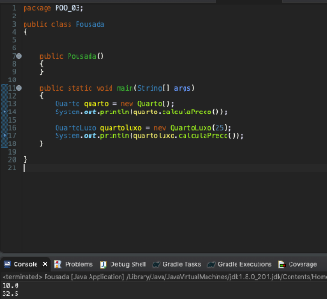
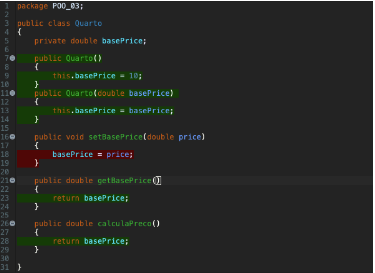
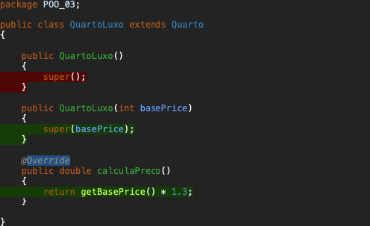

#Atividade POO 3:

Para um jogo didático escrever um programa chamado Pousada que tem uma superclasse abstrata Quarto que tem o campo precoBase com os seus getter e setter e o método abstrato calculoPreco() e também também 2 subclasses Normal e Luxo. O método calculoPreco() da subclasse Normal retorna o próprio precoBase e o método calculoPreco() da subclasse Luxo retorna o precoBase acrescido de 30%

Resultado:
 

Classes:

